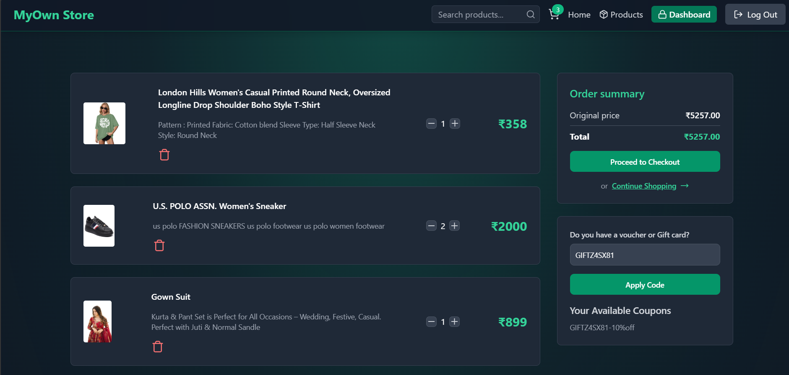
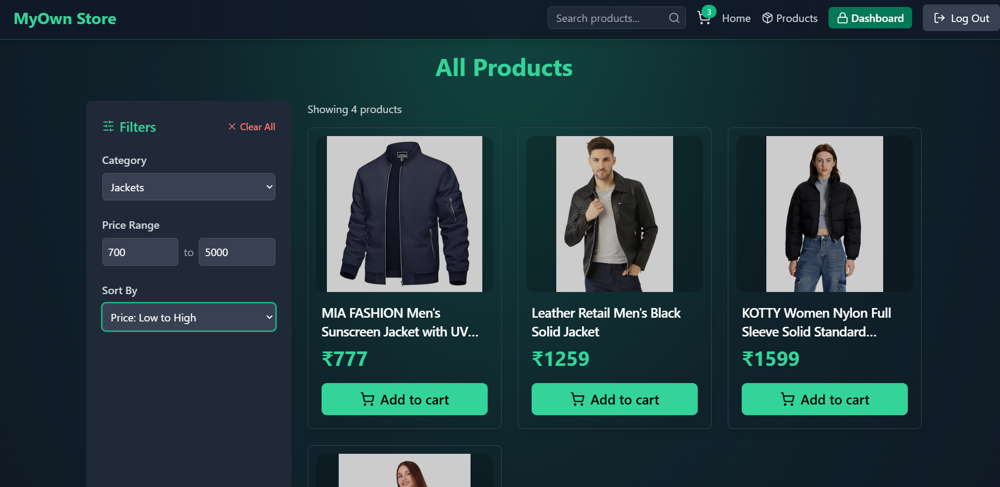

<!-- Shatakshig19 -->

# E-Commerce Platform

A full-stack e-commerce application built with the MERN stack (MongoDB, Express, React, Node.js). This application offers a modern shopping experience with secure user authentication, product management, shopping cart functionality, payment processing, and analytics.


## ✨ Features

- 🔒 **Secure Authentication**: JWT-based user authentication with access and refresh tokens
- 🛒 **Shopping Cart**: Add, update, and remove products from your cart
- 💳 **Stripe Payment Integration**: Secure checkout process with Stripe
- 🏷️ **Coupon System**: Apply discount coupons during checkout
- 📱 **Responsive Design**: Works on desktop and mobile devices
- 👤 **User Profiles**: Manage your account and orders
- 📊 **Admin Dashboard**: Manage products and view analytics
- 🖼️ **Image Storage**: Cloudinary integration for product images
- ⚡ **Performance Optimized**: Redis caching for featured products

## 📸 Screenshots

<details>
<summary>Click to view screenshots</summary>

### User Interface

|              Home Page               |               Login Page               |               SignUp Page                |
| :----------------------------------: | :------------------------------------: | :--------------------------------------: |
|  |  |  |

### Shopping Experience

|                  Search Filter                   |              Cart               |                   Product Filters                    |
| :----------------------------------------------: | :-----------------------------: | :--------------------------------------------------: |
|  |  |  |

### Special Sections

|                    People Also Bought                     |                    Featured Products                    |
| :-------------------------------------------------------: | :-----------------------------------------------------: |
|  |  |

### Admin Features

|                 Admin Dashboard                 |                   Analytics                   |                   Create Product                   |
| :---------------------------------------------: | :-------------------------------------------: | :------------------------------------------------: |
|  |  |  |

</details>

## 🛠️ Technologies Used

### Frontend

- **React** with Vite
- **Tailwind CSS** for styling
- **Framer Motion** for animations
- **Zustand** for state management
- **React Router** for navigation
- **Axios** for API requests
- **Stripe.js** for payment processing
- **React Hot Toast** for notifications

### Backend

- **Node.js** with Express
- **MongoDB** for database
- **Redis** for caching and token storage
- **JWT** for authentication
- **Stripe** for payment processing
- **Cloudinary** for image storage
- **bcryptjs** for password hashing

## 📋 Prerequisites

Before you begin, ensure you have the following installed:

- Node.js (v14 or later)
- npm or yarn
- MongoDB
- Redis

## 🚀 Installation

### Clone the repository

```bash
git clone https://github.com/Shatakshig19/E-commerce.git
cd e-commerce
```

### Backend Setup

1. Install backend dependencies:

```bash
npm install
```

2. Create a `.env` file in the root directory with the following variables:

```env
# Server
PORT=5000
NODE_ENV=development

# MongoDB
MONGO_URI=mongodb://localhost:27017/ecommerce

# JWT Authentication
ACCESS_TOKEN_SECRET=your_access_token_secret
REFRESH_TOKEN_SECRET=your_refresh_token_secret

# Redis
UPSTASH_REDIS_URL=redis://localhost:6379

# Cloudinary
CLOUDINARY_CLOUD_NAME=your_cloud_name
CLOUDINARY_API_KEY=your_api_key
CLOUDINARY_API_SECRET=your_api_secret

# Stripe
STRIPE_SECRET_KEY=your_stripe_secret_key
CLIENT_URL=http://localhost:5173
```

3. Start the backend server:

```bash
npm run dev
```

### Frontend Setup

1. Navigate to the frontend directory and install dependencies:

```bash
cd frontend
npm install
```

2. Start the frontend development server:

```bash
npm run dev
```

3. The application should now be running at `http://localhost:5173`

## 📝 Environment Variables

### Backend (.env)

| Variable              | Description                          | Example Value                       |
| --------------------- | ------------------------------------ | ----------------------------------- |
| PORT                  | Backend server port                  | 5000                                |
| NODE_ENV              | Environment (development/production) | development                         |
| MONGO_URI             | MongoDB connection string            | mongodb://localhost:27017/ecommerce |
| ACCESS_TOKEN_SECRET   | Secret for JWT access tokens         | a_very_long_random_string           |
| REFRESH_TOKEN_SECRET  | Secret for JWT refresh tokens        | another_very_long_random_string     |
| UPSTASH_REDIS_URL     | Redis connection URL                 | redis://localhost:6379              |
| CLOUDINARY_CLOUD_NAME | Cloudinary cloud name                | your-cloud-name                     |
| CLOUDINARY_API_KEY    | Cloudinary API key                   | 123456789012345                     |
| CLOUDINARY_API_SECRET | Cloudinary API secret                | abcdefghijklmnopqrstuvwxyz          |
| STRIPE_SECRET_KEY     | Stripe secret API key                | sk*test*...                         |
| CLIENT_URL            | Frontend URL                         | http://localhost:5173               |

## 🔍 Usage

### User Features

1. **Browse Products**: View all products or filter by categories
2. **Shopping Cart**: Add products to cart, adjust quantities
3. **Checkout**: Secure checkout with Stripe payment processing
4. **Account Management**: Sign up, login, view order history

### Admin Features

1. **Product Management**: Add, edit, delete products
2. **Toggle Featured Products**: Mark products as featured to display on the homepage
3. **Analytics Dashboard**: View sales data, user statistics, and revenue analytics

## 📊 API Endpoints

<details>
<summary>Authentication Endpoints</summary>

- `POST /api/auth/signup` - Register a new user
- `POST /api/auth/login` - Login a user
- `POST /api/auth/logout` - Logout a user
- `GET /api/auth/profile` - Get user profile
- `GET /api/auth/refresh-token` - Refresh access token

</details>

<details>
<summary>Product Endpoints</summary>

- `GET /api/products` - Get all products (admin)
- `GET /api/products/featured` - Get featured products
- `GET /api/products/category/:category` - Get products by category
- `GET /api/products/recommendations` - Get recommended products
- `POST /api/products` - Create a new product (admin)
- `PATCH /api/products/:id` - Toggle product as featured (admin)
- `DELETE /api/products/:id` - Delete a product (admin)

</details>

<details>
<summary>Cart Endpoints</summary>

- `GET /api/cart` - Get cart items
- `POST /api/cart` - Add item to cart
- `DELETE /api/cart` - Remove all items from cart
- `PUT /api/cart/:id` - Update item quantity

</details>

<details>
<summary>Coupon Endpoints</summary>

- `GET /api/coupons` - Get available coupons
- `POST /api/coupons/validate` - Validate a coupon code

</details>

<details>
<summary>Payment Endpoints</summary>

- `POST /api/payments/create-checkout-session` - Create a checkout session
- `POST /api/payments/checkout-success` - Handle successful checkout

</details>

<details>
<summary>Analytics Endpoints</summary>

- `GET /api/analytics` - Get analytics data (admin)

</details>

## ⚠️ Common Issues

- **Redis Connection**: Ensure Redis server is running
- **MongoDB Connection**: Verify MongoDB URI and connection
- **Stripe Errors**: Check Stripe API keys and webhook configuration
- **Image Upload**: Verify Cloudinary credentials and configuration

## 📄 License

This project is licensed under the MIT License - see the LICENSE file for details.

## 🤝 Contributing

Contributions are welcome! Please feel free to submit a Pull Request.

---

Made with ❤️ by Shatakshi Goel
